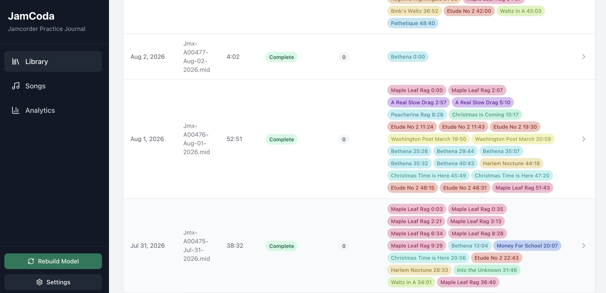
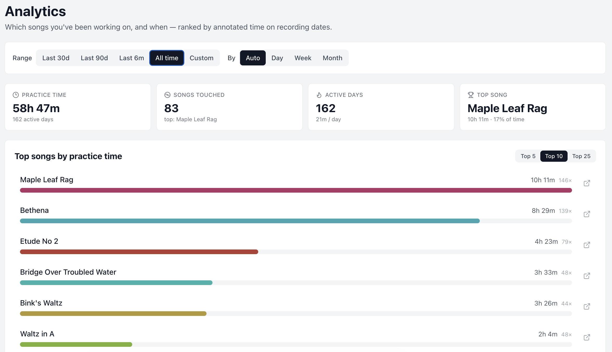
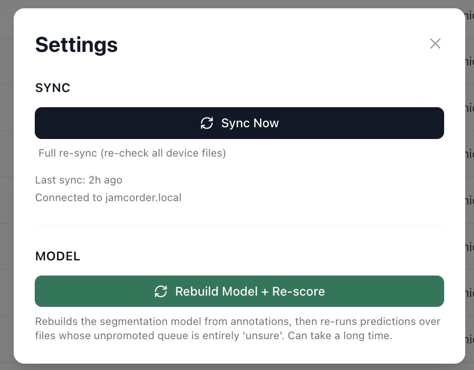

# JamCoda

[](https://github.com/jordanderson/jamcoda/actions/workflows/ci.yml)

JamCoda makes it easy to organize and review MIDI practice sessions generated by the amazing [Jamcorder](https://jamcorder.com).

Jamcorder produces one MIDI file per day with all your practice sessions. That's fantastic, but if you play a lot and want to know exactly which songs you played, or follow your progress on one piece over time, you have to go through each recording and label it by hand. The magic of Jamcorder is that every note is captured as MIDI data, and that's enough to recognize songs you've played before.

JamCoda does that for you. It:

1. Syncs the MIDI files from the Jamcorder onto your computer.
2. Gives you a user-friendly way to annotate song segments.
3. Runs an ML segmentation model that learns from your annotations and proposes song segments.
4. Lets you review, edit, and promote those proposed songs into new annotations.

The more you annotate, the better the model gets at proposing segments for you to review.

Here I run predictions on a session with nothing annotated yet, and JamCoda proposes fifteen segments. I listen to the first few, adjust their start and end times where needed, and promote them into annotations. Then I rebuild the model so it learns from the new annotations. (Turn the sound on for the video below.)

https://github.com/user-attachments/assets/34c06c95-3db9-446a-a16c-b6f8555c7923

## Workflow

### Sync and browse

`Sync Now`, in the Settings modal opened from the sidebar, pulls new
recordings. `Full re-sync` beneath it re-checks every file on the device.
Recordings containing no notes are not imported — the device sometimes opens
and closes assets without recording — and the sync summary reports how many
were ignored.

Files are listed in `#/browse` with annotation progress, an unreviewed prediction
count, and song chips that jump to a timestamp. Sort by date or by most
unreviewed predictions.



### Annotate

Open a file at `#/detail/:id` for the piano roll. Play with `P`, mark a segment
with `S` and `E`, clear the marks with `C`, or turn on `Select Region` and drag
across the roll. `Add Annotation` enters one by hand. Annotations can be
edited, split at a silent gap, trimmed, or snapped to the notes actually played.

The device's own markers — passage bookmarks and the silence gaps it recorded —
appear on the roll and as chips below it that jump to their time.

Three to five whole takes of a song, from different sessions, are usually
enough for the model to find its later takes; eight to ten get it as good as it
will get. See
[How many takes to annotate](ml/README.md#how-many-takes-to-annotate).

`Mark Complete` says every take in the file is annotated, so its remaining time
holds no song. Complete files are the only place the model learns what "no
song" sounds like, so mark a file complete once every take in it is annotated,
and not before. Marking a file complete also clears its predictions and blocks
further prediction runs until it is marked incomplete.


### Review predictions

`Run Predictions` generates proposals for the open file. They appear as
segments on the roll; click one to review it against the audio, then
`Confirm & Promote`, `Edit & Promote`, or `Mark Invalid`. Promoting turns a
proposal into an annotation the next rebuild can learn from.


Prediction Lab, on the same page, previews how different decoder settings would
change the proposals before you commit a run.


### Songs and analytics

`#/songs` lists every annotated segment across all files, so you can play takes
of one piece from different sessions back to back. Filter with the dropdown or
`#/songs?song=<name>`, and rename a song globally — the rename updates
annotations and prediction reviews together, then rebuilds the model so it
learns the new name.

`#/analytics` groups practice time by song and date over a chosen range
(Last 30d / 90d / 6m / All time / Custom) and periodicity (Auto / Day / Week /
Month), with top-song bars, a practice-over-time trend, and a sortable table.



### Rebuild the model

`Rebuild Model` in the sidebar retrains from all current annotations and writes
`data/ml/model.json`. The button shows a badge when annotations have changed
since the model was built, or when songs exist that the model has never seen.
Rebuild after updating JamCoda, too: the badge doesn't track new releases, and a
new release's training changes take effect only when you rebuild.

`Rebuild Model + Re-score`, in Settings, also re-runs predictions for files
whose unpromoted proposals are all still `unsure`.



[How JamCoda works](https://jordanderson.github.io/jamcoda/)
is an illustrated walkthrough of how the model finds songs in a recording.

## Download the desktop app

Prebuilt desktop apps for macOS, Windows and Linux are on the
[Releases page](https://github.com/jordanderson/jamcoda/releases). No Node,
terminal or `.env` file is needed: data lives in the OS's standard per-user
app-data directory, and the Jamcorder address is set from the app's own
Settings dialog.

These builds are currently unsigned. On macOS, the first launch is blocked;
open System Settings → Privacy & Security, choose "Open Anyway" beside the
JamCoda message, and confirm. Windows SmartScreen shows a similar warning —
choose "More info", then "Run anyway".

The desktop app's server listens on `127.0.0.1:47831` and answers only the
app's own page, so neither other devices on the network nor websites open in
a browser can reach it. It does not interfere with `npm run dev`, which
keeps port 3001.

## Getting started

### Prerequisites

- Node.js 24+ (`.nvmrc` pins 24; run `nvm use` if you use nvm)
- A Jamcorder reachable at `http://jamcorder.local`, or set `JAMCORDER_URL`

### Install and set up

```bash
npm install
npm run setup
```

`npm run setup` asks where your Jamcorder is and where to keep your data, then
writes `.env`. Press Enter to accept each default. Re-run it any time;
your latest answers become the defaults.

To do it by hand, copy `.env.example` to `.env` and edit. Skipping setup
entirely also works: the defaults below apply.

The database is SQLite through Node's built-in `node:sqlite`, so there is no
native module to compile, and the same code runs under Node and in the
desktop app.

### Run

```bash
npm run dev
```

Frontend on `http://localhost:5173`, backend on `http://localhost:3001`. Vite
serves the local API routes first, then forwards any remaining `/api/*` to the
Jamcorder.

## Configuration

All configuration is optional and read from environment variables. `npm run dev`
and every `npm run` script load `.env` from the repo root; a variable already
set in your shell takes precedence.

| Variable                             | Default                  | Purpose                                                                                                                          |
| ------------------------------------ | ------------------------ | -------------------------------------------------------------------------------------------------------------------------------- |
| `JAMCORDER_URL`                      | `http://jamcorder.local` | Base URL of your Jamcorder (mDNS name or IP).                                                                                    |
| `JAMCODA_DB_PATH`                    | `./data/jamcoda.db`      | SQLite database location.                                                                                                        |
| `JAMCODA_MIDI_DIR`                   | `./data/midi`            | Where synced MIDI files are written. Absolute paths work, so the library can live outside the repo.                              |
| `JAMCODA_SERVER_PORT`                | `3001`                   | Port for the local backend. The Vite proxy targets 3001, so moving it also means editing `LOCAL_API_TARGET` in `vite.config.ts`. |
| `JAMCORDER_LIBRARY_PAGE_SIZE`        | `5`                      | Assets per library API page during sync. Keep it small; large pages can crash low-power firmware.                                |
| `JAMCORDER_LIBRARY_PAGE_DELAY_MS`    | `1000`                   | Pause between library pages.                                                                                                     |
| `JAMCODA_SYNC_DOWNLOAD_PACE_MS`      | `300`                    | Pause between file downloads.                                                                                                    |
| `JAMCORDER_DOWNLOAD_RETRIES`         | `2`                      | Retries for a failed file download.                                                                                              |
| `JAMCORDER_DOWNLOAD_RETRY_DELAY_MS`  | `1500`                   | Pause before the first download retry. Retry *n* waits *n* times this long.                                                      |
| `JAMCODA_SYNC_EMPTY_ASSET_MAX_BYTES` | `1024`                   | Device assets at or below this size hold no notes and are not imported.                                                          |

## Local data

By default everything lives under `data/`, which is gitignored:

- `data/jamcoda.db` — SQLite
- `data/midi/YYYY-MM-DD/<filename>.mid` — synced recordings
- `data/ml/` — trained models and evaluation reports

Tables: `files` (synced metadata, completion, and the device's bookmarks and
silence gaps), `annotations` (your labels),
`prediction_reviews` (model proposals and review decisions), `sync_metadata`.

Migrations run automatically at startup and are tracked in `schema_migrations`.
Run them by hand with `npm run db:migrate`, adding
`-- --db /path/to/jamcoda.db` to target another database.

## Scripts

| Script                            | Does                                                                                                          |
| --------------------------------- | ------------------------------------------------------------------------------------------------------------- |
| `npm run dev`                     | Client + server                                                                                               |
| `npm run build`                   | Typecheck + Vite production build                                                                             |
| `npm run typecheck`               | `src/`, `core/`, `server/`, `ml/` and tooling                                                                 |
| `npm test`                        | All tests (Vitest; `npm run test:server` or `test:client` to narrow)                                          |
| `npm run setup`                   | Interactive first-run setup; writes `.env`                                                                    |
| `npm run db:migrate`              | Apply pending migrations                                                                                      |
| `npm run db:prune-empty`          | Delete synced recordings with no notes (dry run; `--apply` writes)                                            |
| `npm run db:backfill-bookmarks`   | Parse JMX bookmarks and silence gaps for already-synced files                                                 |
| `npm run db:repair-promotions`    | Re-link promotions orphaned by a deleted annotation (dry run; `--apply` writes)                               |
| `npm run db:rescale-silent-tempo` | Rescale stored times for files that declare no tempo (dry run; `--apply` writes, `--verify` checks durations) |
| `npm run ml:train`                | Train a model from annotations                                                                                |
| `npm run ml:predict`              | Predict segments for one MIDI file                                                                            |
| `npm run ml:predict-import`       | Predict and import into `prediction_reviews`                                                                  |
| `npm run ml:predict-missing`      | Same, for every incomplete file with no predictions (`--force` re-runs)                                       |
| `npm run ml:eval`                 | Evaluate the model, leave-one-out by default (`--mode insample`); writes a JSON report                        |
| `npm run ml:compare`              | Paired comparison of two evaluation reports                                                                   |
| `npm run ml:fit-confidence`       | Refit the display-only confidence calibration (prints weights; writes nothing)                                |
| `npm run electron:dev`            | Electron shell + Vite dev server, for fast desktop-UI iteration                                               |
| `npm run electron:build`          | Build the packaged desktop app locally, unpublished (`release/`)                                              |
| `npm run electron:release`        | Same, then publish to GitHub Releases                                                                          |

## Playback

Playback uses a small Web Audio sampler (`src/audio/pianoSampler.ts`) with no
audio dependencies. Everything is normalized to acoustic grand piano regardless
of the MIDI program. Samples come from the `sgm_plus` soundfont that Google's
Magenta project hosts (`p{pitch}_v{velocity}.mp3`, pitches 21-108, eight velocity layers).
Before a recording plays, the sampler downloads the samples it needs and keeps them in
memory for the session; the browser's cache serves them after that.

## Architecture

- `core/` — pure, isomorphic domain code shared by every tier: the row shapes
  that cross the HTTP boundary, MIDI decoding and Jamcorder tempo detection,
  range algebra, analytics, prediction-review rules and confidence
  calibration. `core/cli/` is its one Node-only part. Start here.
- `src/` — React + Vite, hash routing (`#/browse`, `#/detail/:id`, `#/songs`,
  `#/analytics`).
- `server/` — Express (port 3001 by default), `node:sqlite`, migrations, and
  the maintenance scripts behind `db:*`.
- `ml/` — the segmentation model; `ml/songSegmentation.ts` is the public
  surface over `ml/segmentation/`.
- `scripts/` — `npm run setup`, `npm run electron:bundle`.
- `electron/` — the desktop app shell: window/lifecycle, per-user config, and
  the IPC bridge Settings uses to edit the Jamcorder address and reveal the
  data folder. It runs `server/` in a utility process through
  `server/desktopHost.ts`, with `JAMCODA_LOOPBACK_ONLY=1`.

## Documentation

- [How JamCoda works](https://jordanderson.github.io/jamcoda/) — an
  illustrated walkthrough of the segmentation pipeline
  ([source](docs/index.html)).
- [`ml/README.md`](ml/README.md) — model commands, settings and evaluation.
- [`ml/CHANGELOG.md`](ml/CHANGELOG.md) — model versions and the experiments
  behind them.
- [`API_NOTES.md`](API_NOTES.md) — Jamcorder device behavior we've learned from experience.
- [`AGENTS.md`](AGENTS.md) — repo runbook and invariants.
- [`CONTRIBUTING.md`](CONTRIBUTING.md) and [`STYLE_GUIDE.md`](STYLE_GUIDE.md) —
  contribution workflow and UI design rules.
- Official [device API](https://www.jamcorder.com/docs/device-api) and
  [JMX MIDI format](https://www.jamcorder.com/docs/jmx-midi-files) references.

## Dependencies

The dependency tree is deliberately small. MIDI decoding
(`core/midi/noteSequence.ts`, on `midi-file`), playback
(`src/audio/pianoSampler.ts`, Web Audio) and the piano roll (plain SVG) are all
implemented here rather than taken from a framework, so no ML or audio
framework is installed.

## License

MIT. See [`LICENSE`](LICENSE).
